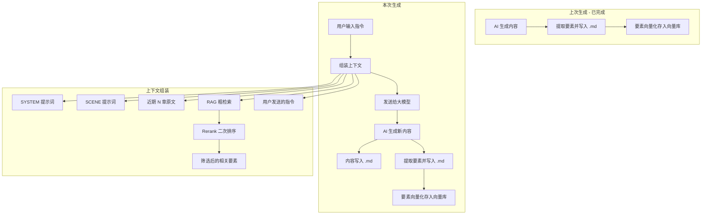

# NovAI（诺艾）- 产品规划

> [!info] 项目名称
> **NovAI / 诺艾** — Nov 取自 Novel（小说），AI 标识智能。一个让 AI 成为你的小说创作伙伴的工具。

## 一、项目定位

一个专门用于**长篇小说创作**的 AI 辅助工具。不是聊天工具的变体，而是一个以**文件为中心**、以**RAG 为核心**的专业小说创作平台。

> [!abstract] 一句话描述
> 参考 Claude Code 的交互理念，但服务于小说创作——让 AI 直接操作文件，用向量检索替代暴力上下文，实现千万字级别的长篇故事持续生成。

## 二、问题背景

### 2.1 现有工具的局限性

当前市面上的 AI 酒馆类工具本质上是**聊天工具**，其上下文管理机制如下：

1. **滑动窗口机制**：每次只向模型发送最近 N 轮对话（如 10 轮），而非全部历史记录
2. **长记忆机制**：每进行 N 轮对话，让 AI 在后台总结，将高信息密度的摘要存储起来，拼接到每次请求的前面

### 2.2 痛点

在使用酒馆工具创作了约 **110 万字**的长篇故事后，暴露出以下严重问题：

- **上下文溢出**：随着"长记忆"积累的内容越来越多，大模型的上下文容量不堪重负
- **生成质量下降**：AI 开始忽略大量已存储的信息，生成速度严重卡顿
- **被迫删减记忆**：不得不手动删除较早期存储的"记忆"来换取正常运行，导致**故事连贯性被破坏**

> [!danger] 核心矛盾
> 传统方案的"全部塞给模型"思路，在百万字级别的长篇创作中**根本不可持续**。

## 三、技术选型

| 维度    | 选择             | 说明                    |
| :---- | :------------- | :-------------------- |
| 前端框架  | Vue            | --                    |
| 项目形态  | 纯前端（无自建后端）    | 本地化运行，LLM 等能力通过云端 API 调用       |
| 桌面端打包 | Tauri（候选）      | 轻量，支持 Windows / macOS |
| 移动端打包 | Capacitor（候选）  | 支持 Android 安装包        |
| 向量检索 | Orama | 纯 JS 向量搜索引擎，存储 Embedding 向量索引，加速 RAG 语义检索（见下方说明） |
| 版本管理  | Git            | 校对版本管理、内容回退           |
| 文件格式  | Markdown / JSON | 章节内容、要素数据以 .md 存储，项目配置以 JSON 存储 |

> [!note] 关于"向量检索"的说明
> 项目中存在**两层存储**，职责不同：
>
> | 存储方式 | 存什么 | 谁在用 |
> |:---------|:-------|:-------|
> | **.md / JSON 文件** | 章节内容、人物卡片、时间线、项目配置等**正式数据** | 人看的 + AI 读的 |
> | **Orama（IndexedDB）** | 要素的 Embedding 向量，用于**语义相似度检索** | 仅工具内部使用，用户无需关心 |
>
> .md 和 JSON 是"真相来源（Source of Truth）"，Orama 索引只是"检索加速用的缓存"。删掉 Orama 索引，工具重新扫描 .md 并调用 Embedding API 重建索引即可，数据不会丢失。

### 支持平台

- ✅ Windows
- ✅ macOS
- ✅ Android
- ❌ iOS（暂不考虑）
- ❌ 鸿蒙（暂不考虑）

## 四、核心架构

### 4.1 RAG 驱动的上下文管理（核心创新）

> [!tip] 设计理念
> 不再"把所有内容一股脑塞给模型"，而是**只把与当前情节相关的内容发送给模型**。

#### 小说要素拆解

将故事中发生的一切，由 AI 分析、总结为以下核心要素：

| 要素 | 说明 | 示例 |
|:-----|:-----|:-----|
| **时间** | 故事发生的时间线、时间节点 | "第三纪元 3021 年春" |
| **地点** | 场景、地理位置、环境描写 | "北境长城·黑城堡" |
| **人物** | 角色信息、性格、关系、状态变化 | "林远·性格沉稳·习剑十五年" |
| **情节** | 事件、冲突、转折、伏笔 | "主角在悬崖边发现密道" |
| **其他** | 物品、势力、世界观设定等扩展要素 | "灵石·蕴含天地灵气" |

#### 工作流程



> [!note] 图解
> 每次生成包含两个阶段：**上下文组装**（从多个来源收集并筛选信息）和**内容生成**（AI 生成故事并提取要素）。要素的持续积累使得 RAG 检索越来越精准。

### 4.1.1 两阶段检索：粗检索 + 精排

> [!warning] RAG 的固有局限
> RAG 检索基于语义相似度，但**语义相似 ≠ 情节相关**。例如：主角在第 1 章是初学者，第 50 章已是宗师——RAG 可能会检索出第 1 章的过时状态，因为它们"语义上确实在说同一件事"。

因此，上下文组装采用**两阶段检索**：

| 阶段 | 执行者 | 做什么 | 目的 |
|:-----|:-------|:-------|:-----|
| **粗检索** | 向量数据库 | 根据用户指令的语义，检索相似度 Top K 的要素 | 从海量要素中快速缩小候选范围 |
| **精排** | Rerank 模型 | 结合用户指令，对候选要素进行二次排序并保留 Top N | 过滤掉语义相似但情节无关的噪音 |

**精排时参考的辅助信息**：

| 辅助信息 | 说明 | 示例 |
|:---------|:-----|:-----|
| **时间衰减权重** | 越新的要素优先级越高，避免早期过时信息干扰 | 第 49 章的人物状态 > 第 1 章的人物状态 |
| **要素元数据** | 每个要素文件携带 `last_updated_chapter`、`related_chapters` 等信息 | `林远.md` 标注"最后更新于第 49 章" |
| **用户指令意图** | 用户当前指令本身就是最强的相关性信号 | "林远突破瓶颈"→ 需要的是林远当前状态，而非早期经历 |

> [!tip] 为什么不用单一阶段？
> 如果只靠 RAG 检索，相似度低的门槛会放进来太多噪音，高的门槛又会遗漏真正需要的信息。引入 Rerank 精排后，RAG 可以**宁多勿少**地检索候选，再由专门的排序模型把真正更相关的要素排到前面。

**关键优势**：
- 无论小说写到多长（百万字、千万字），每次发送给模型的上下文始终是**可控的、相关的**
- 不会因为故事变长而降低生成质量或速度
- 历史信息不会丢失，只是按需检索
- **两阶段检索**确保送入模型的上下文既不遗漏关键信息，也不会被过时或无关信息干扰

### 4.2 文件系统设计（参考 Obsidian）

> [!note] 设计原则
> 一个文件夹 = 一个小说项目。所有配置、内容、要素均在文件夹内自包含，项目之间互不干扰。

#### 项目文件夹结构

```
我的第一本小说/                      ← 一个小说项目
├── novel.config.json                ← 项目配置文件（模型、参数等）
├── prompts/                         ← 提示词配置
│   ├── system.md                    ← SYSTEM 级提示词
│   └── scenes/                      ← SCENE 级提示词
│       ├── scene-001.md
│       └── scene-002.md
├── chapters/                        ← 小说章节（平铺展示）
│   ├── 第001章-初入江湖.md
│   ├── 第002章-遇险.md
│   └── ...
├── elements/                        ← 小说要素数据
│   ├── characters/                  ← 人物
│   │   ├── 林远.md
│   │   └── 苏婉.md
│   ├── locations/                   ← 地点
│   ├── timeline/                    ← 时间线
│   ├── plots/                       ← 情节
│   └── worldbuilding/               ← 世界观/其他
├── .git/                            ← Git 版本管理
└── .novel/                          ← 工具内部数据（向量库索引等）
    └── vector.db
```

**设计好处**：
- **可扩展**：新增要素类型只需新建文件夹
- **可迁移**：整个文件夹拷贝即完成项目迁移
- **可读性**：所有内容都是 .md，人类可读可编辑
- **无用户系统**：不同小说的数据天然隔离，不需要用户账号

## 五、功能模块

### 5.1 模型配置模块

提供三套独立的模型配置页面，分别接入 LLM、Embedding 和 Rerank 服务：

#### LLM 配置

| 配置项 | 说明 | 示例 |
|:-------|:-----|:-----|
| API 地址 | LLM 服务的 Base URL | `https://api.openai.com/v1`、`https://api.deepseek.com/v1` |
| API Key | 认证密钥 | `sk-xxx` |
| 模型名称（可选） | 同一 API 地址下的具体模型 | `gpt-4o`、`deepseek-chat` |

#### Embedding 配置

| 配置项 | 说明 | 示例 |
|:-------|:-----|:-----|
| API 地址 | Embedding 服务的 Base URL | `https://api.openai.com/v1` |
| API Key | 认证密钥 | `sk-xxx` |
| 模型名称（可选） | 具体的 Embedding 模型 | `text-embedding-3-small` |

#### Rerank 配置

| 配置项 | 说明 | 示例 |
|:-------|:-----|:-----|
| 是否启用 | 是否启用精排层 | `true` |
| API 地址 | Rerank 服务的 Base URL | `https://dashscope.aliyuncs.com/compatible-mode/v1` |
| API Key | 认证密钥 | `sk-xxx` |
| 模型名称 | 具体的 Rerank 模型 | `gte-rerank-v2`、`qwen3-vl-rerank` |
| 模式 | 文本或多模态 | `text` |
| 保留条数 | 重排后保留的候选数 | `8` |

> [!important] 为什么独立配置？
> LLM、Embedding 和 Rerank 的服务提供商可能不同，接口行为和计费方式也不同。独立配置避免误操作导致其中一层不可用。详见 [需求说明书 - 模型配置](需求说明书.md)。

> [!note] 设计原则
> 不内置任何模型选项，不限定具体厂商。用户填什么就能用什么，包括国产模型、自建模型网关等。

### 5.2 项目设置模块

提供统一的设置页面，集中管理各功能模块的可调参数（如校对默认章节数、整理默认章节数、生成上下文章节数、RAG 粗检索返回条数等），所有参数保存在 `novel.config.json` 中。详见 [需求说明书 - 项目设置](需求说明书.md)。

### 5.3 内容生成模块

> [!important] 交互理念
> 参考 Claude Code 的 Vibe Coding 模式——**AI 直接操作文件，而非在聊天窗口中输出内容**。

#### 交互方式

- 用户发出生成指令（如"写第三章，主角进入秘境"）
- AI **直接将内容写入对应的 .md 文件**
- 界面**实时预览**正在生成的内容（类似 Claude Code 的文件编辑预览）
- 不提供富文本编辑器——需要修改时，直接告诉 AI 改就行，或者让用户使用Obsidian 或者 Typora 等其他Markdown工具打开编辑

#### 为什么不做编辑器？

- 富文本编辑器和 Markdown 编辑器的开发成本都极高
- 用户的核心需求是**创作**，不是**排版**
- AI 本身就是最好的"编辑器"——告诉它要改什么就行

### 5.4 AI 提示词调教模块

> [!tip] 核心理念
> 平台不内置"最佳提示词"，而是让用户**与 AI 商量着来**，共同定制适合自己风格的提示词。

平台只定义两个层级的提示词：

#### SYSTEM 级提示词（系统级）

- **作用范围**：全局生效，定义整部小说的**基调和风格**
- **内容示例**：小说类型（玄幻/都市/科幻）、文风偏好、叙事视角、字数密度、用户个人习惯等
- **交互方式**：提供一个独立的**对话窗口**，用户与 AI 通过多轮对话来商量、迭代、最终确定系统提示词

#### SCENE 级提示词（场景级）

- **作用范围**：针对特定章节/情节段落的**场景设定**
- **内容示例**：当前章节的核心冲突、需要推进的剧情线、氛围基调、需要登场的人物等
- **交互方式**：同样提供**对话窗口**，与 AI 商量确定

> [!note] 上下文组装流程详见 [第四章 工作流程图](#工作流程)

### 5.5 AI 校对模块

> [!warning] 约束条件
> 校对功能的提示词由开发团队预先调教，**严格约束 AI 不能胡乱修改故事情节**。

#### 校对方向

| 方向 | 说明 |
|:-----|:-----|
| **要素 → 章节** | 根据已有的要素数据，检查章节内容是否有遗漏或矛盾 |
| **章节 → 要素** | 根据新写的章节内容，检查并更新要素数据（如人物状态变化、新地点等） |
| **一致性检查** | 检查前后章节之间是否存在逻辑矛盾、设定冲突 |

#### 校对流程

1. 用户选择要校对的章节（可多选），未选择时默认校对最后 N 章
2. AI 读取目标章节内容 + 相关要素
3. 逐章检查，生成校对报告（差异点、建议修改项）
4. 用户确认后，AI 执行修改
5. 修改后的内容自动提交到**新的 Git 分支**

### 5.6 AI 章节整理模块

> [!tip] 核心理念
> 创作时零约束，整理时让 AI 来做。

用户在创作过程中可以完全自由地命名文件、随意分段。当需要规范化时，执行 AI 章节整理命令：

#### 整理规则

整理规范（命名规则、字数范围、拆分/合并策略等）由用户通过提示词与 AI 商量确定，与 SYSTEM / SCENE 提示词的调教方式一致。

#### 整理流程

1. 用户选择要整理的章节范围（如"最近 20 个文件"），或全选
2. AI 读取目标文件内容，按照已约定的整理规范进行拆分、合并、重命名
3. 生成整理预览（哪些文件会被拆分、合并、重命名）
4. 用户确认后，AI 执行文件操作
5. 变更自动提交到 **Git**

### 5.7 版本管理模块

> [!note] 设计决策
> 使用 Git 做版本管理，但不参考 Claude Code 的 Session 级历史回退——小说的结构更容易理解，容错率更高。

#### 版本管理策略

- **主分支（main）**：存储经过确认的正式内容
- **校对分支（proofread/*）**：每次 AI 校对产生的新分支
- **备份分支（backup/*）**：用户可手动创建的存档点

#### 核心功能

- 自动保存：每次 AI 生成/修改后自动 Git commit
- 校对隔离：校对结果在独立分支，不影响主内容
- 分支对比：可视化查看校对前后的差异
- 版本回退：如果 AI 改坏了，一键回退到之前的版本
- 分支合并：确认校对无误后，合并到主分支

### 5.8 对话上下文管理

> [!info] 适用范围
> 适用于所有对话窗口（提示词调教、内容修改、校对、整理等），不适用于内容生成流程。

参考 Vibe Coding 工具的上下文管理方式：

| 项目 | 说明 |
|:-----|:-----|
| **Token 上限** | 用户可在项目设置中配置 |
| **自动压缩** | 对话 Token 达到上限 80% 时自动触发 |
| **手动压缩** | 对话窗口提供"压缩上下文"按钮 |
| **压缩方式** | AI 将较早的对话生成摘要，替换原始记录，保留最近 N 轮原文 |
| **用户感知** | 压缩后旧消息折叠为摘要（可展开查看），对话可正常继续 |

## 六、与现有工具的对比

| 特性        | AI 酒馆工具    | Claude Code | 本工具               |
| :-------- | :--------- | :---------- | :---------------- |
| **定位**    | AI 聊天      | 代码编写        | 小说创作              |
| **上下文管理** | 滑动窗口 + 长记忆 | 文件索引 + 工具调用 | **RAG 两阶段检索**      |
| **内容存储**  | 数据库/聊天记录   | 文件系统        | **文件系统（.md）**     |
| **交互方式**  | 聊天窗口输出     | 文件直接编辑      | **文件直接编辑 + 实时预览** |
| **长文本支持** | 百万字后严重退化   | 无此场景        | **理论上无上限**        |
| **提示词管理** | 手动编写       | 内置 + 用户自定义  | **AI 协助编写**       |
| **版本管理**  | 无          | Session 级历史 | **Git 分支管理**      |
| **数据所有权** | 本地         | 本地          | **本地，可迁移**        |

## 七、已确认的设计决策

| 决策项 | 结论 | 说明 |
|:-------|:-----|:-----|
| 模型调用方式 | 全部云端 API | 不支持本地模型（Ollama 等），LLM、Embedding 和 Rerank 均通过云端 API 调用 |
| 模型接入方式 | 通用配置，不限定模型 | 用户自行填写 API 地址和 API Key 即可接入任意兼容 OpenAI 格式的模型 |
| LLM 与 Embedding 配置 | 必须独立配置 | 不共用同一套 API 地址和 Key，避免服务提供商不同或接口行为差异导致的误操作 |
| RAG 检索策略 | 两阶段：粗检索 + Rerank 精排 | RAG 语义相似 ≠ 情节相关，因此先粗检索获取候选，再由专门排序模型重新排序，必要时再由 LLM 做高级审校 |
| 生成上下文 | 携带近期 N 章原文 | 除 RAG 检索要素外，还直接加载最后 N 章原文，确保叙事连贯性 |
| 文本分块策略 | AI 提取要素即分块 | 不采用传统 RAG 的算法分块，由 AI 在生成内容后自动提取要素，每个要素文件天然就是一个向量化块，无需额外的中文分词处理 |
| 章节管理 | 自由创作 + AI 整理 | 创作时文件名完全自由，提供 AI 章节整理命令，整理规范由用户通过提示词与 AI 商量确定 |
| 提示词版本管理 | 内存版本列表（不使用 Git） | 对话过程中的提示词历史版本仅存储在内存中，关闭即清空；最终确认的版本写入文件 |
| 对话上下文压缩 | Vibe Coding 风格 | 设置 Token 上限，接近上限时自动压缩，同时提供手动压缩按钮 |
| 批量校对 | 支持多选 | 用户可自选要校对的章节，未选择时默认校对最后 N 章 |
| 多平台支持 | 第一阶段仅浏览器端 | 移动端性能和打包方案（Tauri / Capacitor）延后到后续阶段考虑 |
| 向量检索引擎 | Orama | 纯 JS、轻量、支持混合搜索，小说场景千到万级数据量性能足够。详见 [技术架构设计](技术架构设计.md) |
| Git 集成 | isomorphic-git | 纯 JS、活跃维护（v1.37.x），功能覆盖完全满足需求。需自行封装 Diff 和 File System Access API 适配器 |
| 文件访问 | File System Access API | 浏览器端直接操作本地文件系统，仅 Chromium 支持。后续 Tauri 桌面端消除此限制 |

## 八、待评估的技术难点

> [!success] 向量数据库选型已确定
> 已选定 Orama 作为向量检索引擎，详见 [技术架构设计 - 向量检索](技术架构设计.md#22-向量检索orama)。

> [!warning] 以下问题需要在开发前或开发中持续评估

- **File System Access API 适配器**：需要将 isomorphic-git 的 `fs` 接口桥接到 File System Access API 的目录句柄上，具体实现细节需在开发时验证

## 九、后续阶段考虑

- [ ] **导入已有小说内容**：导入小说后由 AI 自动提取所有要素进行初始化（暂不考虑，优先保证新项目的核心链路）

## 十、开发阶段建议

> [!quote] 建议采用 MVP 模式，先跑通核心链路

### Phase 1 - 核心链路验证
- LLM、Embedding 和 Rerank 独立的模型配置页面（各自 API 地址 + Key + 模型名称）
- 项目文件夹结构搭建
- 基础的 RAG 上下文管理（要素提取 → 向量存储 → 粗检索 → Rerank 精排）
- 生成时携带近期 N 章原文作为叙事上下文
- AI 生成内容并写入 .md 文件
- 实时预览

### Phase 2 - 提示词系统
- SYSTEM / SCENE 两级提示词管理
- AI 协助编写提示词的对话窗口

### Phase 3 - 校对 & 版本管理
- AI 校对功能 + 预调教提示词
- Git 集成（自动 commit、分支管理、差异对比）

### Phase 4 - 多平台打包
- Windows / macOS / Android 安装包制作
- 各平台适配测试

---

> [!quote] 总结
> NovAI 的本质是一个**以 RAG 为引擎、以文件系统为基石、以 Git 为安全网**的长篇小说创作平台。它不是聊天工具的延伸，而是从小说创作的实际需求出发，重新设计的专业工具。
