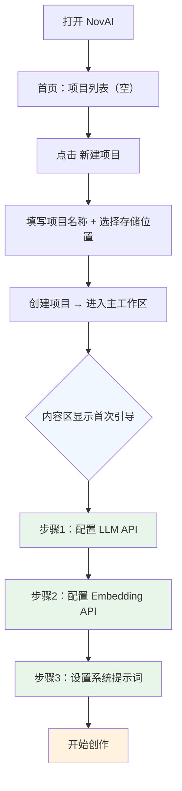
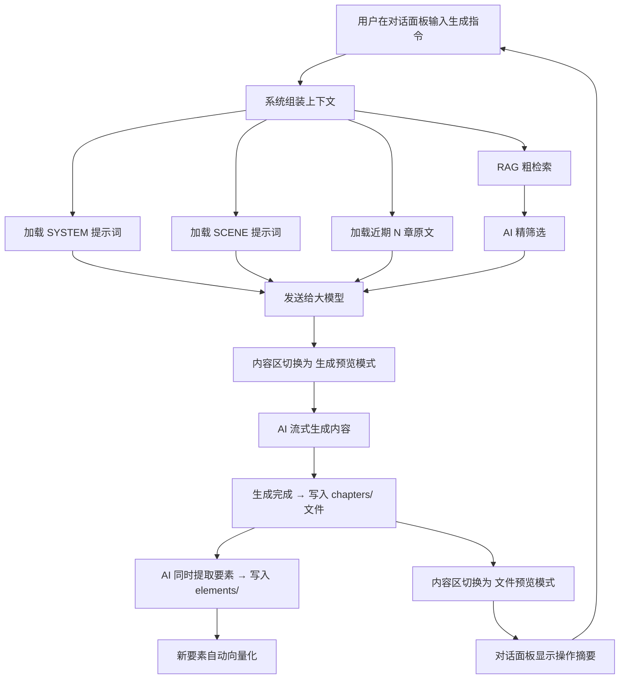
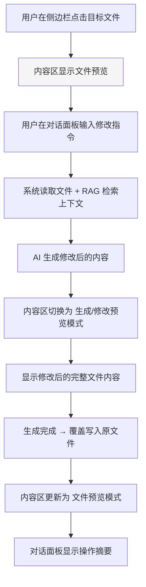
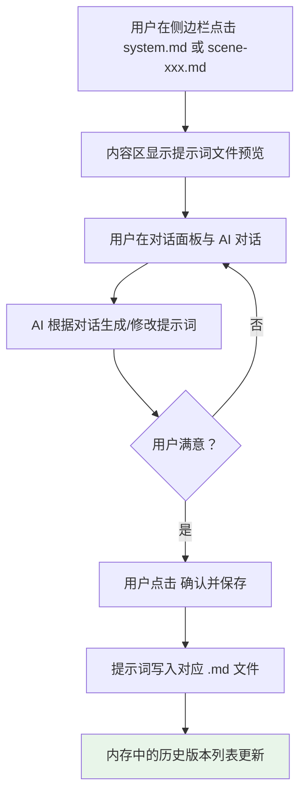
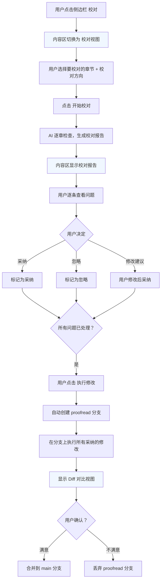
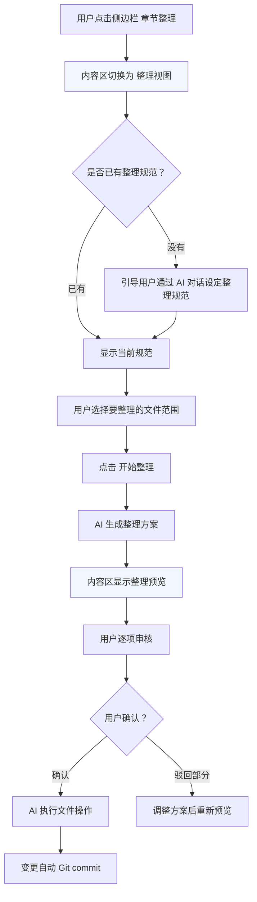
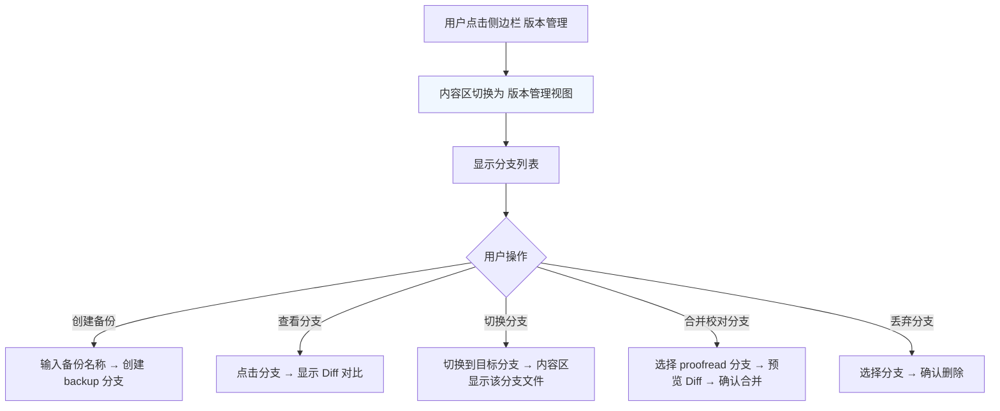
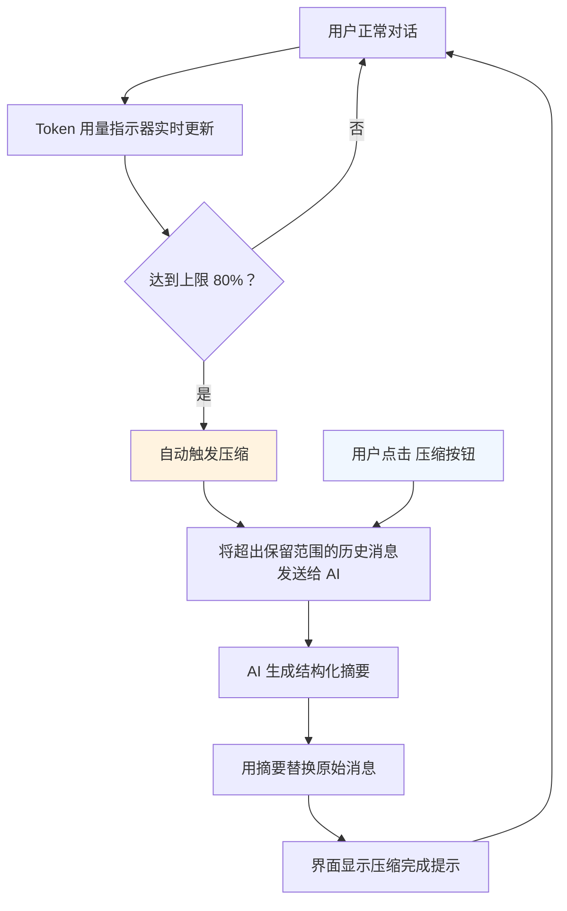

# NovAI（诺艾）- UI 设计文档

> [!info] 本文档定位
> 描述 NovAI 的**页面结构**和**核心交互流程**，供前端开发参考。
> 组件级的视觉设计（样式、配色、动画、响应式断点等）由前端开发自主决定，本文档不作规定。
>
> 相关文档：
> - 产品规划：[产品规划](NovAI产品规划.md)
> - AI 功能需求：[AI功能需求说明书](AI功能需求说明书.md)

## 一、概述

### 1.1 设计原则

| 原则 | 说明 |
|:-----|:-----|
| **文件为中心** | 界面围绕文件操作展开，用户随时可浏览项目中的任意文件 |
| **对话驱动** | AI 交互是核心操作方式，对话面板在主工作区始终可用 |
| **渐进式暴露** | 复杂功能（校对、整理、版本管理）不在首页堆砌，按需触发 |
| **类 Obsidian 布局** | 参考 Obsidian 的布局逻辑——侧边栏文件树 + 主内容区 |
| **直接操作** | 参考 Claude Code 的理念——AI 直接操作文件，不做多余的确认弹窗 |

### 1.2 信息架构总览

```
NovAI
├── 首页（项目列表）
│   ├── 新建项目
│   └── 打开项目 → 进入主工作区
│
└── 主工作区（核心页面）
    ├── 左侧栏：文件树 + 功能入口
    ├── 主区域：AI 对话面板
    ├── 右侧面板：内容区（侧面板，按需展开）
    │   ├── 文件预览（默认）
    │   ├── 生成/修改预览
    │   ├── 提示词编辑
    │   ├── 校对视图
    │   ├── 整理视图
    │   └── 版本管理视图
    └── 设置页（独立路由）
        ├── LLM 配置
        ├── Embedding 配置
        └── 项目设置
```

---

## 二、页面清单

| 页面 | 路由 | 说明 | 首次可达 |
|:-----|:-----|:-----|:--------|
| 首页 | `/` | 项目列表，新建/打开项目 | ✅ |
| 主工作区 | `/project/:id` | 核心页面，AI 对话为主区域 + 内容侧面板 | 从首页进入 |
| 设置页 | `/project/:id/settings` | 模型配置 + 项目参数设置 | 从主工作区进入 |

> [!note] 关于"校对"、"整理"、"版本管理"
> 这三个功能**不是独立页面**，而是主工作区右侧内容区的**视图模式**。触发后内容区自动展开，切换为对应的专用视图，左侧文件树和中央对话面板保持可用。详见 [三、页面结构设计 - 3.2 主工作区](#321-整体布局)。

---

## 三、页面结构设计

### 3.1 首页（项目列表）

**路由**：`/`

#### 布局

```
┌──────────────────────────────────────────────────┐
│  NovAI（诺艾）                        [全局设置]    │  ← 顶栏
├──────────────────────────────────────────────────┤
│                                                  │
│   ┌──────────┐  ┌──────────┐  ┌──────────┐       │
│   │ 项目名称  │  │ 项目名称  │  │           │       │  ← 项目卡片列表
│   │ 最后编辑  │  │ 最后编辑  │  │  + 新建   │       │
│   │章节数/字数 │ │ 章节数/字数│  │  项目     │       │
│   └──────────┘  └──────────┘  └──────────┘       │
│                                                  │
└──────────────────────────────────────────────────┘
```

#### 组成元素

| 区域 | 元素 | 说明 |
|:-----|:-----|:-----|
| 顶栏 | 品牌标识 | "NovAI（诺艾）" logo / 文字 |
| 顶栏 | 全局设置（可选） | 预留给未来可能的全局配置（如默认模型） |
| 主体 | 项目卡片 | 每个项目一张卡片，显示项目名称、最后编辑时间、章节/字数概览 |
| 主体 | 新建项目按钮 | 点击后弹出创建对话框 |

#### 新建项目对话框

弹出模态框，用户填写：

| 字段 | 说明 | 必填 |
|:-----|:-----|:-----|
| 项目名称 | 小说项目的名称 | ✅ |
| 存储位置 | 项目文件夹的路径（浏览器端需通过 File System Access API 选择） | ✅ |

> [!info] 浏览器端的文件访问
> 纯前端架构下，项目文件夹的访问和读写依赖浏览器的 [File System Access API](https://developer.mozilla.org/en-US/docs/Web/API/File_System_Access_API)。用户首次打开项目时需要授权目录访问权限，后续访问同一目录时浏览器可能再次要求确认。
> 该 API 目前仅 Chromium 内核浏览器（Chrome、Edge）支持，Firefox 和 Safari 暂不支持。这是纯前端方案的固有限制。

#### 空状态

首次使用或无项目时，主体区域显示引导提示：

```
  欢迎使用 NovAI
  点击「新建项目」开始你的第一部小说
```

---

### 3.2 主工作区

**路由**：`/project/:id`

这是 NovAI 的核心页面，用户绝大部分操作都在此完成。

#### 3.2.1 整体布局

采用**侧边栏 + 主区域 + 侧面板**的布局，AI 对话作为核心占据主区域：

```
┌────────────┬─────────────────────────────┬──────────────┐
│            │                             │              │
│   侧边栏    │       AI 对话面板（主区域）    │  内容区（侧面板）│
│            │                             │              │
│  [文件树]   │  [对话历史]                   │  [文件预览]   │
│  [功能入口]  │                             │  [生成预览]   │
│            │  [输入区域]                   │  [提示词编辑]  │
│            │                             │  [Diff 视图]  │
│            │  [压缩按钮]                   │              │
└────────────┴─────────────────────────────┴──────────────┘
```

各栏行为：
- **侧边栏**：可折叠/展开，展开时显示文件树和功能入口
- **AI 对话面板**（主区域）：占据中央主要空间，是用户的核心操作区域
- **内容区**（侧面板）：默认折叠，按需展开（抽屉/侧边栏形式），适合笔记本电脑屏幕

#### 3.2.2 侧边栏

侧边栏分为两个区域：

**上方：文件树**

```
┌─────────────────────┐
│ ▼ chapters/          │
│   第001章-初入江湖.md │
│   第002章-遇险.md     │
│   ...                │
│ ▼ elements/          │
│   ▼ characters/      │
│     林远.md           │
│     苏婉.md           │
│   ▼ locations/       │
│   ▼ timeline/        │
│   ▼ plots/           │
│   ▼ worldbuilding/   │
│ ▼ prompts/           │
│   system.md          │
│   ▼ scenes/          │
│     scene-001.md     │
└─────────────────────┘
```

- 树形结构，展示项目文件夹中的所有文件
- 文件夹可展开/折叠
- 点击文件：在右侧内容区展开并打开该文件的预览
- 文件树实时反映文件系统变化（AI 新建/修改文件后自动更新）

**下方：功能入口**

```
┌─────────────────────┐
│ 📝 校对              │  ← 点击进入校对视图
│ 📁 章节整理          │  ← 点击进入整理视图
│ 🔀 版本管理          │  ← 点击进入版本管理视图
│ ⚙️ 设置             │  ← 跳转设置页
└─────────────────────┘
```

#### 3.2.3 AI 对话面板（主区域）

对话面板是 NovAI 的**核心交互区域**，占据主工作区的中央主要空间。用户绝大多数操作（生成、修改、提示词调教、校对、整理）都通过此面板与 AI 对话完成。

```
┌──────────────────────────────────────┐
│  AI 对话                       [压缩] │  ← 标题栏
├──────────────────────────────────────┤
│                                      │
│  🤖 已生成第003章-密境遇险.md            │  ← AI 消息（文件操作结果摘要）
│     提取了 3 个人物要素、1 个地点要素     │
│                                      │
│  👤 写第四章，林远在密境深处发现...       │  ← 用户消息
│                                      │
│  🤖 已生成第004章-灵兽之缘.md            │
│     提取了 2 个人物要素、2 个地点要素     │
│                                      │
│  ── 上下文已压缩 ──                    │  ← 压缩后的摘要（可展开）
│  > 已完成第3-10章的创作，主要情节...     │
│                                      │
│  👤 把第三章的结尾改得更紧张一些...       │
│  🤖 已修改第003章-密境遇险.md            │
│                                      │
├──────────────────────────────────────┤
│  Token: ████░░░░ 60%                 │  ← 上下文用量指示器
├──────────────────────────────────────┤
│  [输入指令...   ]           [发送]     │  ← 文本输入区域
└──────────────────────────────────────┘
```

| 元素 | 说明 |
|:-----|:-----|
| 对话历史 | 消息列表，支持滚动查看历史。AI 消息显示操作摘要（如"已生成 xxx.md"），而非生成的具体内容 |
| 压缩摘要 | 上下文被压缩后，早期消息折叠为一条摘要，可展开查看详细内容 |
| Token 用量指示器 | 可视化当前对话的 Token 占用情况。接近上限时变色提醒（如黄色 80%、红色 95%） |
| 压缩按钮 | 手动触发对话上下文压缩 |
| 输入区域 | 文本输入框 + 发送按钮，始终可见可输入 |

> [!important] 对话面板 vs 内容区
> 对话面板**不显示** AI 生成的小说正文内容或提示词正文。正文/提示词在右侧内容区的对应视图中展示。对话面板只显示操作摘要和对话交互。
> 这与 Claude Code 的设计一致：操作结果在文件区展示，对话区只显示操作描述和沟通内容。

> [!tip] 为什么对话面板在中间？
> NovAI 的一切操作都基于 AI 对话——生成、修改、提示词调教、校对、整理，用户始终在与 AI "聊天"。内容预览只是辅助性的查看需求，因此将对话面板放在最醒目的中央位置。内容区以侧面板形式按需展开，也更适合笔记本电脑等小屏幕设备。

#### 3.2.4 内容区（侧面板）

内容区是**辅助性**的查看区域，默认折叠，按需从右侧展开。

**展开/折叠行为**：
- **默认状态**：折叠，不占用主区域空间
- **自动展开**：AI 生成/修改内容时、用户点击文件树中的文件时、用户进入校对/整理/版本管理视图时
- **手动操作**：用户可随时折叠/展开，可拖拽调整宽度
- **小屏适配**：笔记本电脑屏幕上，内容区与对话面板可能无法同时显示，此时内容区以**覆盖式抽屉**或**模态框**形式弹出，查看完毕后关闭

**视图模式**：

内容区根据当前操作自动切换显示不同视图：

| 视图模式 | 触发条件 | 显示内容 |
|:---------|:---------|:---------|
| **文件预览** | 用户点击侧边栏中的文件 | Markdown 渲染预览 |
| **生成/修改预览** | AI 正在生成或修改章节内容时 | 实时流式预览（生成完成后保持为文件预览） |
| **提示词编辑** | 用户打开提示词文件（system.md / scene-xxx.md）并进入调教对话时 | 提示词草稿实时预览 + 版本历史 |
| **校对视图** | 用户点击侧边栏"校对" | 校对配置 + 校对报告 + Diff 对比 |
| **整理视图** | 用户点击侧边栏"章节整理" | 整理配置 + 整理方案预览 + Diff 对比 |
| **版本管理视图** | 用户点击侧边栏"版本管理" | 分支列表 + Diff 对比 |

> [!note] 校对/整理/版本管理视图的展开方式
> 这三个视图需要较大的显示空间（包含配置表单 + 列表 + Diff）。在内容区展开时，建议自动扩展为较宽的面板，或在屏幕空间不足时以模态框形式全屏展示。

**文件预览模式**（默认）：

```
┌──────────────────────────┐
│ 第001章-初入江湖.md [原始]  │  ← 标题栏：文件名 + 预览/原始切换
├──────────────────────────┤
│                          │
│  青石板路蜿蜒在两座         │  ← Markdown 渲染内容
│  山峰之间，晨雾尚未         │
│  散去……                   │
│  林远背着一柄长剑，         │
│  步伐稳健地走在山道上。      │
│  ……                      │
│                          │
└──────────────────────────┘
```

- 标题栏显示当前打开的文件名
- 提供"预览/原始"切换按钮，可在渲染预览和 Markdown 源码之间切换

**生成/修改预览模式**：

AI 生成或修改章节内容时，内容区自动展开并切换为此模式：

```
┌──────────────────────────┐
│ 🔄 正在生成 第003章...     │  ← 生成状态指示
├──────────────────────────┤
│                          │
│  密境的入口藏在一面         │  ← AI 生成的内容实时流式显示
│  断崖之后，藤蔓覆盖了……█     │  ← 光标表示生成进行中
│                          │
└──────────────────────────┘
```

- 显示当前操作类型（生成/修改）和目标文件
- 内容以流式方式逐字显示
- 生成完成后自动保存，内容区切换为"文件预览"模式显示新文件

**提示词编辑模式**：

用户打开提示词文件并开始与 AI 对话调教时，内容区展开并切换为此模式：

```
┌──────────────────────────┐
│ 提示词编辑 · system.md     │  ← 标题栏
├──────────────────────────┤
│ 版本: v3 (当前)  [◄ v2] [◄ v1] │  ← 版本切换控件
├──────────────────────────┤
│                          │
│  你是一位玄幻小说创作者...   │  ← 当前版本的提示词草稿实时预览
│                          │
│  文风要求：                │
│  - 第三人称叙事            │
│  - 偏热血风格              │
│  - 段落节奏紧凑            │
│  ……                      │
│                          │
└──────────────────────────┘
```

- 显示当前提示词草稿的实时预览（AI 每次迭代都更新此区域）
- 顶部提供**版本切换控件**，可在内存中的历史版本之间前后跳转
- 用户点击"确认并保存"后，提示词写入对应 .md 文件，视图切换为"文件预览"模式

---

### 3.3 设置页

**路由**：`/project/:id/settings`

采用选项卡式布局，将三组配置集中在一个页面：

```
┌──────────────────────────────────────────────┐
│  ← 返回项目     项目设置                       │  ← 顶栏
├──────────────────────────────────────────────┤
│  [LLM 配置] [Embedding 配置] [项目设置]        │  ← 选项卡
├──────────────────────────────────────────────┤
│                                              │
│  （当前选项卡对应的配置表单）                    │
│                                              │
│  API 地址：[________________]                 │
│  API Key：[________________]                 │
│  模型名称：[________________]（可选）           │
│                                              │
│  [测试连接]                    [保存]          │
│                                              │
└──────────────────────────────────────────────┘
```

#### 选项卡 1：LLM 配置

| 配置项 | 类型 | 必填 | 说明 |
|:-------|:-----|:-----|:-----|
| API 地址 | 文本输入 | ✅ | LLM 服务的 Base URL |
| API Key | 密码输入 | ✅ | 认证密钥，默认隐藏显示 |
| 模型名称 | 文本输入 | ❌ | 指定模型，不填使用 API 默认 |

底部操作：
- **测试连接**：调用轻量接口验证连通性，显示成功/失败结果
- **保存**：保存到 `novel.config.json` 的 `llm` 字段

#### 选项卡 2：Embedding 配置

| 配置项 | 类型 | 必填 | 说明 |
|:-------|:-----|:-----|:-----|
| API 地址 | 文本输入 | ✅ | Embedding 服务的 Base URL |
| API Key | 密码输入 | ✅ | 认证密钥，默认隐藏显示 |
| 模型名称 | 文本输入 | ❌ | 指定模型，不填使用 API 默认 |

底部操作与 LLM 配置相同。

#### 选项卡 3：项目设置

| 参数 | 类型 | 说明 | 默认值 |
|:-----|:-----|:-----|:-------|
| 校对默认章节数 | 数字输入 | 自动校对最后 N 章 | 3 |
| 整理默认章节数 | 数字输入 | 自动整理最后 N 章 | 10 |
| 生成上下文章节数 | 数字输入 | 生成时携带最后 N 章原文 | 3 |
| RAG 粗检索返回条数 | 数字输入 | 粗检索阶段返回的候选数 | 20 |
| 对话上下文 Token 上限 | 数字输入 | 接近上限时触发压缩 | 视模型而定 |
| 压缩保留轮数 | 数字输入 | 压缩时保留最近 N 轮原文 | 5 |

> [!note] "对话上下文 Token 上限"的默认值
> 不同模型的上下文窗口大小不同（如 8K、32K、128K、200K）。建议在用户首次配置 LLM 后，根据模型自动查询其上下文窗口大小并设置合理的默认值（如窗口的 70%）。如无法自动查询，则显示提示让用户手动填写。

---

## 四、核心交互流程

### 4.1 首次使用流程

用户第一次使用 NovAI 的完整流程：



**首次引导**：用户首次进入空白项目时，内容区显示引导提示，列出需要完成的设置步骤。每个步骤可点击跳转（配置步骤跳转设置页，提示词步骤打开 `prompts/system.md`）。用户可跳过引导，直接开始使用。

### 4.2 日常创作流程（内容生成）



**用户感知**：
1. 在对话面板输入指令 → 回车发送
2. 内容区自动切换，开始显示 AI 生成的正文（流式）
3. 侧边栏文件树实时更新（新文件出现）
4. 生成完毕，内容区自动打开新文件预览
5. 对话面板显示一条摘要消息（如"已生成第003章-密境遇险.md，提取了 3 个人物要素、1 个地点要素"）

### 4.3 内容修改流程



> [!note] 修改的安全机制
> 修改操作直接覆盖原文件，不弹确认框（遵循"直接操作"原则）。
> Git 会自动记录变更，用户如不满意可通过版本管理回退。

### 4.4 提示词调教流程



**版本历史交互**：

在提示词调教过程中，每次 AI 生成新版本时：
1. 上一版本自动存入内存中的版本列表
2. 用户可在对话面板中通过指令（如"回到上一个版本"、"从第 2 个版本重新改"）在版本间跳转
3. 版本列表仅存在于当前编辑会话，关闭页面后清空

### 4.5 校对流程



**校对视图布局**：

```
┌──────────────────────────────────────────────────┐
│  校对                              [← 返回文件]    │
├──────────────────────────────────────────────────┤
│  选择章节：[✓] 第001章  [✓] 第002章  [✓] 第003章    │
│  校对方向：[✓] 要素→章节  [✓] 一致性检查              │
│                              [开始校对]           │
├──────────────────────────────────────────────────┤
│                                                  │
│  校对报告（共 5 个问题）                            │
│                                                  │
│  ❌ 第001章 第3段：人物名称不一致                   │
│     位置：chapters/第001章-初入江湖.md:45          │
│     描述：「林远」在第1章中被称为「林远」，但要素         │
│           记录中名字为「林渊」                      │
│     建议：统一为「林远」                            │
│     操作：[采纳] [忽略] [编辑建议]                  │
│                                                  │
│  ⚠️ 第002章 第7段：时间线矛盾                       │
│     ……                                           │
│                                                  │
└──────────────────────────────────────────────────┘
```

### 4.6 章节整理流程



**整理视图布局**：

```
┌──────────────────────────────────────────────────┐
│  章节整理                            [← 返回文件]  │
├──────────────────────────────────────────────────┤
│  当前规范：每章 3000-5000 字，命名格式「第XXX章-...」 │
│  [重新设定规范]                                    │
├──────────────────────────────────────────────────┤
│  选择文件：[全选] 或手动勾选                        │
│  ☑ 第001章-初入江湖.md  (4200字)                  │
│  ☑ 第002章-遇险.md      (6800字) ← 超出字数范围     │
│  ☑ 第003章-密境遇险.md  (3100字)                  │
│  ☑ 第004章-战斗.md      (1500字) ← 字数偏少         │
│                              [开始整理]           │
├──────────────────────────────────────────────────┤
│                                                  │
│  整理方案预览                                      │
│                                                  │
│  📂 拆分：第002章-遇险.md                          │
│     → 第002章-遇险（上）.md (3400字)               │
│     → 第003章-密境遇险（重命名）.md (3400字)        │
│                                                  │
│  📂 合并：第004章-战斗.md                          │
│     → 合并至第003章-密境遇险（重命名）.md 的末尾      │
│     （补写过渡段衔接两章内容）                       │
│                                                  │
│  [确认执行]                                       │
│                                                  │
└──────────────────────────────────────────────────┘
```

### 4.7 版本管理流程



**版本管理视图布局**：

```
┌──────────────────────────────────────────────────┐
│  版本管理                            [← 返回文件]  │
├──────────────────────────────────────────────────┤
│                                                  │
│  当前分支：main                                    │
│                                                  │
│  📌 main（当前）               最新提交: 2分钟前    │
│  📌 proofread/20260329-143022   3个文件变更       │
│     [查看差异] [合并到 main] [丢弃]                 │
│  📌 backup/第一卷完结存档        2026-03-28        │
│     [查看差异] [删除]                               │
│                                                  │
│  ─────────────────────────────────               │
│  [+ 创建备份分支]                                  │
│                                                  │
├──────────────────────────────────────────────────┤
│  （点击"查看差异"后显示 Diff 对比视图）              │
│                                                  │
│  📄 chapters/第001章-初入江湖.md                   │
│  - 青石板路蜿蜒在两座山峰之间                       │
│  +  青石板路蜿蜒于两座山峰之间                      │
│                                                  │
└──────────────────────────────────────────────────┘
```

### 4.8 对话上下文压缩交互

压缩在对话面板内部完成，不涉及页面切换：



**压缩后的用户感知**：

压缩前：
```
👤 写第三章...
🤖 已生成第003章...
👤 把结尾改得...
🤖 已修改第003章...
👤 再写第四章...
🤖 已生成第004章...
（还有更多历史消息...）
```

压缩后：
```
── 上下文已压缩（点击展开） ──
> 摘要：用户已完成第3-10章的创作，主要情节包括...
> 待确认：第10章结尾的伏笔尚未收束

👤 修改一下第10章...
🤖 已修改第010章...
```

---

## 五、全局交互规范

### 5.1 导航

| 导航方式 | 说明 |
|:---------|:-----|
| 首页 → 主工作区 | 点击项目卡片 |
| 主工作区 → 设置页 | 点击侧边栏"设置"或顶栏齿轮图标 |
| 设置页 → 主工作区 | 点击"返回"按钮 |
| 主工作区内视图切换 | 由用户操作自动触发（如点击"校对"时右侧内容区展开并切换到校对视图） |
| 主工作区 → 首页 | 浏览器后退，或顶栏"返回项目列表" |

### 5.2 状态反馈

| 场景 | 反馈方式 |
|:-----|:---------|
| AI 正在生成/处理 | 内容区显示加载状态，对话面板输入区域可暂时禁用或允许继续输入 |
| API 调用失败 | 对话面板显示错误消息（红色），包含具体原因 |
| 网络断开 | 顶栏显示网络断开提示，操作中断时提示"已保存已生成的内容" |
| 文件写入成功 | 对话面板显示操作摘要 |
| 配置保存成功 | 设置页显示"保存成功"提示 |

### 5.3 首次使用引导

用户首次进入空白项目时，内容区显示引导提示：

```
┌──────────────────────────────────────────────┐
│                                              │
│   ✅ 欢迎使用 NovAI！                          │
│                                              │
│   在开始创作之前，建议先完成以下设置：           │
│                                              │
│   1. ⬜ 配置 LLM API →              [去配置]   │
│   2. ⬜ 配置 Embedding API →        [去配置]   │
│   3. ⬜ 设置系统提示词 →             [去设置]   │
│                                              │
│   （你也可以跳过这些步骤，稍后再设置）            │
│                                              │
│                           [跳过引导，直接开始]   │
└──────────────────────────────────────────────┘
```

- 每个步骤可点击跳转（配置步骤跳转设置页对应选项卡，提示词步骤在内容区打开 `prompts/system.md`）
- 已完成的步骤自动打勾
- 用户可随时跳过引导，后续通过侧边栏"设置"入口完成配置
